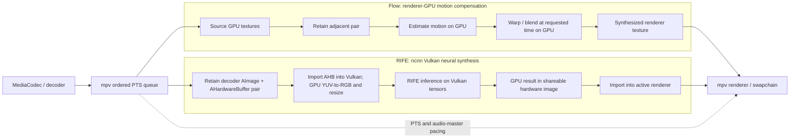

# GPU frame-interpolation architecture

## Keep the algorithms separate; share the playback clock

Both implementations consume the same ordered decoded-frame timeline and use mpv's presentation queue as the timing authority. They do not insert another software frame filter between decode and render. Source PTS, audio-master pacing, seek/reset behavior, and the renderer's frame ownership remain authoritative; each interpolator returns a frame for the requested time or explicitly passes through the nearest source frame.

### Flow path

Flow is motion compensation: estimate motion between adjacent frames once, then synthesize each intermediate time by GPU warping/blending. Its current renderer-level experimental implementation is the GLES compute route on `Mpv∞-flow`; it avoids the CPU `vf` filter and CPU readback. A Vulkan backend can implement the same Flow interface with Vulkan compute when the active renderer exposes compatible textures. Flow remains on its own branch and is not modified here.

### RIFE path

RIFE is a neural frame-synthesis network, not a drop-in optical-flow field generator. Its intended path is MediaCodec surface → retained `AImage`/`AHardwareBuffer` pair → ncnn Vulkan import and GPU color conversion/resize → RIFE Vulkan inference → GPU-resident synthesized image → import into the active renderer. RIFE inference itself can be Vulkan/NCNN even when the display renderer is OpenGL; an OpenGL renderer would consume a shareable output through EGLImage, while a Vulkan renderer would consume it through Android external-memory import. Neither renderer option should require an RGB24 CPU copy.

The conversions above are necessary image-format/model-input operations, but they stay on the GPU. The forbidden path is the current CPU filter round-trip: decode frame → CPU RGB24 conversion/packing → ncnn upload → inference → RGB24 download → mpv output conversion. Merely choosing `hwdec=mediacodec` or `gpu-api=vulkan` does not remove those host transfers.

## Safe frame and timing contract

Each source frame stays retained until both inference and downstream rendering have finished with it. The pair cache is keyed by source-frame identity and is invalidated on seek, stream reset, format/size/transfer change, or failed synchronization. Producer/consumer fences must be honored across MediaCodec, ncnn Vulkan, EGL, and/or the Vulkan renderer. ncnn's Android [AHardwareBuffer guide](https://github.com/Tencent/ncnn/wiki/use-ncnn-with-android-hardware-buffer) specifically calls for retaining buffers, caching import pipelines by allocation, and checking the external-memory extension and actual buffer usage.

Generated frames keep their interpolated PTS and are submitted through mpv's existing presentation path; audio remains master. Unsupported formats, API/extension combinations, or fence failures produce a logged source-frame passthrough, never a claim of active interpolation. Compute still costs time: removing copies can reduce latency, but sustained cadence must be measured on-device. In particular, 24→60 fps requires about 36 synthesized frames per second; GPU residency alone does not guarantee that rate.

## What is implemented on the RIFE branch now

The RIFE branch adds an explicit native Vulkan `VkMat`-in/`VkMat`-out inference API in the pinned RIFE source patch and bridge. When called with compatible RGB tensors from the engine's own ncnn Vulkan device, that API bypasses RIFE's CPU `ncnn::Mat` conversion/upload/download path and keeps the synthesized result as a Vulkan tensor. The existing `vf_rife` and Android playback configuration are deliberately unchanged and still use the CPU RGB24 route; this API is not connected to playback yet, and its current inference submission waits synchronously.

That boundary is intentional. mpv's normal filter API does not expose renderer textures. In pinned mpv, `hwdec_aimagereader.c` requires a GL context and converts an `AImage`'s `AHardwareBuffer` into an EGL external texture inside its private mapper; `vo_gpu_next.c` owns the PTS-aware render queue. A real end-to-end RIFE route therefore still needs a renderer/queue-level AImage lease bridge, Vulkan import/export synchronization, and output-image sharing with GL or Vulkan. Changing only `vf_rife.c` or `hwdec` cannot supply those contracts. See the pinned [mpv AImageReader mapper](https://github.com/mpv-player/mpv/blob/c1529642089bfebfc928a1c1664638a7a5d219ba/video/out/hwdec/hwdec_aimagereader.c) and [gpu-next VO](https://github.com/mpv-player/mpv/blob/c1529642089bfebfc928a1c1664638a7a5d219ba/video/out/vo_gpu_next.c).

## Runtime status and diagnostics

The Android path reports `gpu_resident_path=unavailable` at configuration and filter initialization, including the missing decoder/AHardwareBuffer-to-renderer handoff and ncnn's private Vulkan device. Successful ordinary filter inference is labeled `cpu_path_active` and explicitly records CPU RGB24 upload/download; unsupported MediaCodec/Vulkan hardware frames are labeled passthrough with `gpu_path=inactive` and a specific reason. This is an honesty/capability-gating improvement, not a renderer integration: it does not make the Vulkan `VkMat` API usable from playback.

The existing RIFE playback mode remains installable as CPU-filter interpolation when the inference budget permits, and remains unchanged when RIFE is off. An APK built from this source is not useful for testing GPU-resident interpolation; it can only verify the runtime diagnostics and existing CPU-filter behavior. A usable GPU-resident APK must wait for the AImage/AHardwareBuffer lifetime and fence bridge, same-device ncnn/libplacebo interoperability, and synthesized-output presentation path described above.
